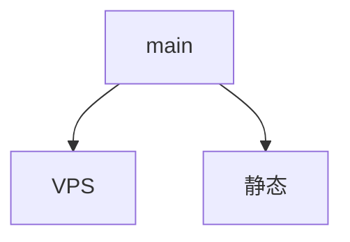

# AnimeCoffeebot机器人初版机器人功能需求分析

## 遵循原则

- 要有翻页，并且能显示当前页
- 搜索到的对应标题，是超链接跳转，点击后能直接跳转到原贴
- 默认不是公开链接，也就是需要加入频道才能查看，也就是之前的总开关切换为第二个
- 我希望跳转到对应原贴的时候，会高亮显示命中的搜索关键字，如果有多个就同时高亮显示3个关键字

## 搜索动漫频道帖子

/s[空格]关键词，如/s 无职转生，支持空格多项匹配，如 /s 无职 转生，返回结果：
>中文名: **无职转生**～到了异世界就拿出真本事～（Mushoku Tensei ~Isekai Ittara Honki Dasu~）
>话数: S1+S2
>放送开始: 2021年1月10日
>放送星期: 星期日
>导演: 岡本学
>脚本: 中本宗応、平野宏樹、岡本学、齊藤浩央
>分镜: 應地千晶、平野宏樹、岡本学、相浦和也、重原克也、高嶋宏之、小林敦、藤井慎吾、菅原静貴、三塩天平
>☺️评分：7.9 力荐
>xxx
>【帖子详情】

注意要列表显示，有上下页，有返回最前最后，关键词高亮等等常规交互功能

